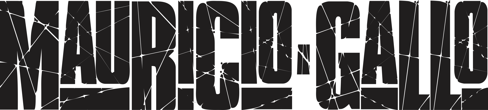

 

# ✅ Descrição do Projeto

Site desenvolvido para o guitarrista Maurício Gallo para fins de estudo.

# 🛠 Tecnologias

- [React](https://pt-br.reactjs.org/)
- [Styled Components](https://styled-components.com/)
- [React Router Dom](https://reactrouter.com/web/guides/quick-start)
- [React Scroll](https://www.npmjs.com/package/react-scroll)

# ✅ Status do Projeto

<h3 align="center"> 
	🚧 Em construção... 🚧
</h3>

# 🖥️ Dev

- [Cirineu Rodrigues](https://www.linkedin.com/in/cirineurodrigues/)
